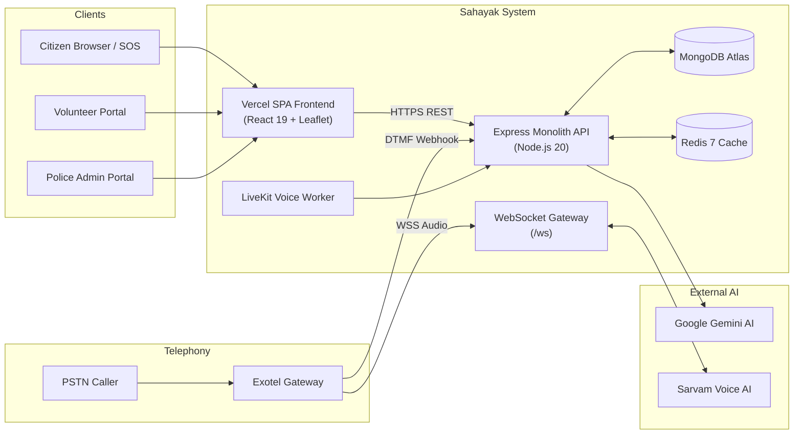

# Sahayak (सहायक) — Intelligent Emergency Assistance & Coordination Platform

[](#testing--verification)
[](#technology-stack)
[](#technology-stack)
[](#technology-stack)

**Sahayak** (सहायक — "Helper/Assistant") is an intelligent, multi-channel emergency assistance and coordination platform built to protect senior citizens, vulnerable individuals, and citizens in distress.

During medical emergencies, falls, or acute crises, navigating multi-step mobile apps is often impossible. Sahayak eliminates cognitive friction by offering zero-login web SOS intake, conversational voice AI in regional Indian languages, live GPS mapping, deterministic volunteer dispatch, and police operations triage.

---

## 🌟 Main Features

* **Zero-Friction Citizen SOS**: Instant one-click web emergency intake with optional browser GPS capture (`navigator.geolocation`) and text address fallback. No prior registration or password required.
* **Interactive Incident Maps**: Leaflet + OpenStreetMap spatial visualization featuring dynamic pulsing radar beacons, circular accuracy overlays, and one-click turn-by-turn Google Maps driving navigation with zero external API key requirements.
* **Conversational Voice AI**: Inbound PSTN telephony handling via Exotel, regional language streaming STT/TTS via Sarvam AI, and conversational audio streaming via LiveKit Cloud workers.
* **AI Emergency Triage**: Automated severity classification and 112 escalation recommendations powered by Google Gemini AI.
* **Deterministic Volunteer Dispatch**: Automated workload-balanced dispatch engine matching urgent incidents to verified, available community volunteers, with deterministic queue promotion when responders are busy.
* **Police Operations Dashboard**: Real-time incident triage center, volunteer verification management, manual dispatch override, and 112 emergency escalation tracking.
* **Distributed Security & Anti-Abuse**:
  - Redis-backed HMAC-SHA256 keyed OTP storage with atomic Lua verification and 5-attempt brute-force lockout.
  - Distributed Redis rate limiting with trusted proxy derivation and fail-closed production posture.
  - AES-256-GCM phone encryption with HMAC-SHA256 blind indexing.
  - Insecure Direct Object Reference (IDOR) protection on victim coordinates.

---

## 🛠️ Technology Stack

| Layer | Technologies |
| :--- | :--- |
| **Frontend** | React 19, TypeScript, Vite 8, Tailwind CSS v4, Leaflet 1.9, OpenStreetMap |
| **Backend** | Node.js 20+ LTS, Express 4.19, WebSockets (`ws`), Zod |
| **Databases** | MongoDB Atlas (operational state & `2dsphere` geospatial indexing), Redis 7 (OTP, rate limiting) |
| **AI & Voice** | Google Gemini (`@google/genai`), Sarvam AI (regional STT/TTS), LiveKit Cloud (WebRTC voice agent), Exotel PSTN |
| **Testing** | Node.js Native Test Runner (`node --test`), 165 automated tests |
| **Deployment** | Vercel Edge Network (Frontend SPA), Docker / Render / AWS ECS (Persistent Backend) |

---

## 🏛️ High-Level Architecture



---

## 👥 Main User Roles

1. **Public Citizen (Unauthenticated)**: Submits one-click emergency SOS requests with optional GPS coordinates and tracks dispatch status via returned request ID.
2. **Community Volunteer (`volunteer`)**: Manages availability, receives nearby emergency dispatches, views victim map with driving navigation, and updates task progress (`accepted` ➔ `in_progress` ➔ `completed`).
3. **Police Administrator (`police_admin`)**: Oversees district-wide incident map, triages high-severity emergencies, verifies volunteer applications, manually overrides dispatch, and escalates to Police 112.

---

## 🔄 Emergency Workflow

```text
[ Citizen Clicks SOS ]
         │
         ▼
[ Captures Browser GPS & Category ]
         │
         ▼
[ POST /api/v1/requests/citizen ] ──► [ Rate Limiting & Validation ]
                                                │
                                                ▼
                                   [ Gemini AI Urgency Triage ]
                                                │
                                                ▼
                                   [ Deterministic Dispatch Engine ]
                                                │
                     ┌──────────────────────────┴──────────────────────────┐
                     ▼                                                     ▼
           (Free Volunteer Found)                                (All Volunteers Busy)
                     │                                                     │
                     ▼                                                     ▼
        [ Dispatched to Volunteer ]                               [ Enqueued in Queue ]
                     │                                                     │
                     ▼                                                     ▼
     [ Volunteer Accepts & Navigates ]                          [ Auto-Promoted on Free ]
                     │
                     ▼
          [ Incident Completed ]
```

---

## 🚀 Quickstart & Setup

### 1. Backend Setup
```bash
# Clone the repository
git clone https://github.com/ankitanayak2003/sahayak.git
cd sahayak

# Install dependencies
npm install

# Configure environment
cp .env.example .env
# Edit .env with your MongoDB Atlas and Redis connection details

# Run backend development server (starts on http://localhost:5000)
npm run dev
```

### 2. Frontend Setup
```bash
# In another terminal, navigate to the frontend directory
cd "fornent end"

# Install dependencies
npm install

# Configure environment
cp .env.example .env

# Run frontend development server (starts on http://localhost:3000)
npm run dev
```

---

## 🧪 Testing & Verification

Sahayak includes a comprehensive automated test suite with zero external test runner dependencies using Node.js's native test runner (`node --test`):

```bash
# Run backend test suite (165 tests)
npm test

# Run frontend TypeScript typecheck
cd "fornent end" && npm run lint

# Build frontend production bundle
cd "fornent end" && npm run build
```

---

## 📊 Project Status

```text
Current demo scope: COMPLETE
```

* **Backend Tests**: 165 passed, 0 failed.
* **Frontend Lint**: 0 TypeScript errors.
* **Frontend Production Build**: Clean build succeeded.
* **Security & Git**: Zero `.env` files tracked; baseline branch `backup/phase-1-2-baseline` untouched.

---

## 📚 Official Project Documentation

Detailed technical and product documentation is maintained in the [`docs/`](./docs) directory:

* [**Product Requirements Document (PRD)**](./docs/prd.md): Problem definition, user personas, workflows, and core feature specifications.
* [**System Architecture**](./docs/architecture.md): System topology, API specifications, data models, Redis security, and voice pipelines.
* [**Project Rules & Security Standards**](./docs/rules.md): Architectural rules, PII encryption policies, Redis constraints, and coding standards.
* [**Implementation Tasks & Status**](./docs/tasks.md): Completed phases, current demo status, and remaining deployment tasks.
* [**Developer Memory & Context**](./docs/memory.md): Durable context, tech choices, operational commands, and architectural invariants.
* [**Production Deployment Guide**](./deploy/DEPLOYMENT.md): Detailed operations guide for Vercel, Docker, Render, and cloud hosting.

---

## 📄 License

ISC License.
