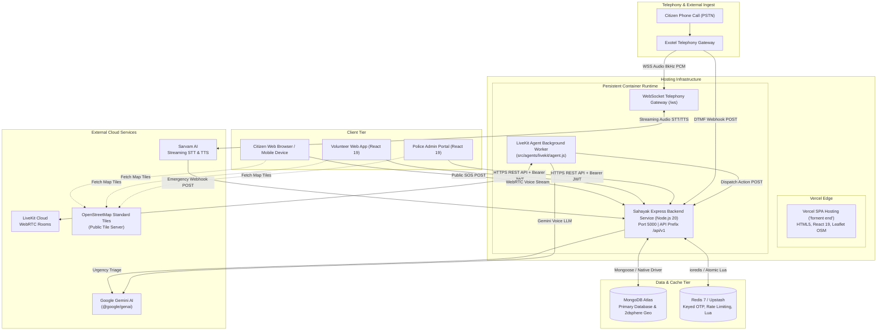
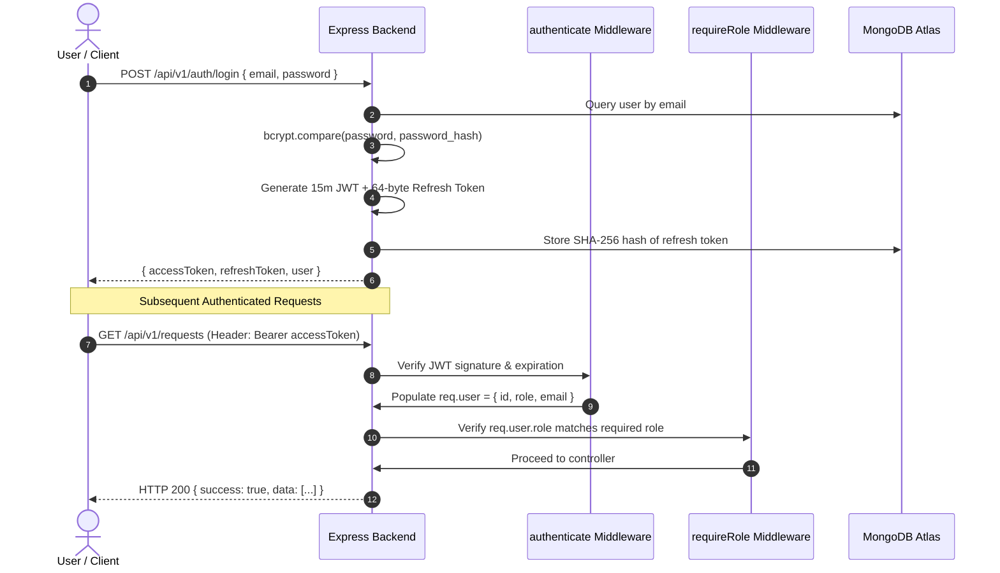
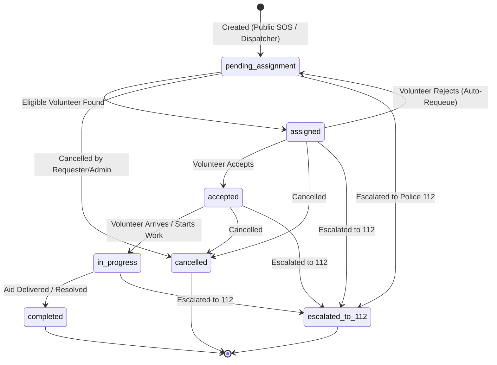
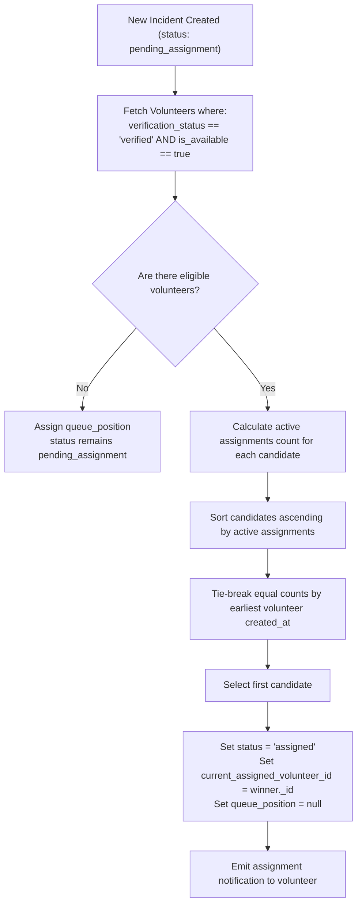

# Sahayak (सहायक) — System Architecture & Technical Specifications

## 1. Overall System Architecture

Sahayak is architected as a decoupled system comprising a responsive Single-Page Application (SPA) deployed to the Vercel Edge Network, a monolithic Express application deployed on a persistent container runtime, MongoDB Atlas for operational and geospatial data, Redis for distributed security and rate-limiting primitives, and external voice/telephony integrations.



---

## 2. Frontend Architecture (`fornent end/`)

* **Framework & Tooling**: React 19.0.1, TypeScript 7.0, Vite 8.3, Tailwind CSS v4.3.
* **Component Model**: Functional components with React hooks, modular layouts, and centralized application context.
* **Global State Management (`AppContext.tsx`)**:
  - Centralizes current user identity, active role (`police_admin` vs `volunteer`), authentication status, active alerts, and real-time request subscriptions.
  - Controls modal visibility (`CitizenEmergencyModal`) across any route.
* **Client-Side Routing & Access Control**:
  - Guarded routes dynamically enforce authorization:
    - `AdminRoute`: Verifies authenticated user has role `police_admin`.
    - `VolunteerRoute`: Verifies authenticated user has role `volunteer` and `verification_status === 'verified'`.
  - Non-verified volunteers are directed to `/pending-approval`.
* **Map & Spatial Visualization (`IncidentMap.tsx`)**:
  - Implemented using Leaflet 1.9.4 and OpenStreetMap raster tiles.
  - Dynamically centers on victim coordinates `[latitude, longitude]`.
  - Displays animated pulsing radar beacon and circular accuracy radius overlay based on `accuracy_meters`.
  - Deep-links to Google Maps driving navigation (`https://www.google.com/maps/dir/?api=1&destination=lat,lng`).
  - No client-side Google Maps API keys required; OpenStreetMap tiles eliminate API credential exposure.
* **API Client (`fornent end/src/services/api.ts`)**:
  - Standardized Fetch wrapper managing base URL (`VITE_API_BASE_URL`), JSON serialization, and error normalization.
  - Dual-token session management:
    - Stores short-lived JWT in `localStorage.getItem('sahayak_access_token')`.
    - Stores refresh token in `localStorage.getItem('sahayak_refresh_token')`.
    - Automatically catches HTTP 401 Unauthorized responses, invokes `POST /api/v1/auth/refresh-token`, rotates tokens, and replays the original request transparently.

---

## 3. Backend Architecture (`src/`)

* **Runtime & Framework**: Node.js 20+ LTS, Express 4.19, CommonJS module system.
* **Modular Router Hierarchy**:
  - Root path `/api/v1` mounts modular domain routers:
    - `/auth`: Registration, credential verification, token rotation, logout.
    - `/volunteers`: Onboarding, phone OTP verification, verification status queries.
    - `/volunteer-business`: Volunteer-specific operational endpoints (acceptance, progress, completion).
    - `/requests`: Public citizen SOS intake, incident triage list, detail inspection, coordinate updates.
    - `/emergencies`: Escalation management, 112 tracking, status audits.
    - `/voice`: Inbound telephony webhooks and DTMF call event handling.
    - `/sarvam`: Regional language voice agent tool intake webhooks.
* **Orchestrator Health & Readiness Probes (`src/routes/health.js`)**:
  - `GET /health/live`: Fast process liveness probe confirming Node.js event loop health.
  - `GET /health/ready`: Deep dependency readiness probe verifying live MongoDB ping and Redis socket connectivity. Returns HTTP 503 if any required service is down.
  - `GET /health`: Backward-compatible legacy health monitoring.
* **Process Lifecycle & Graceful Shutdown (`src/server.js`)**:
  - Intercepts `SIGTERM` and `SIGINT` operating system signals.
  - Stops receiving new HTTP and WebSocket connections.
  - Flushes in-flight HTTP requests.
  - Gracefully closes Redis connection and MongoDB client connections before process exit.

---

## 4. API Structure & Endpoint Specifications

| Method | Endpoint | Auth Required | Required Role | Description |
| :--- | :--- | :--- | :--- | :--- |
| `POST` | `/api/v1/requests/citizen` | No | Public (Rate-limited) | Public citizen emergency SOS submission |
| `POST` | `/api/v1/requests` | Yes | `police_admin` | Administrative emergency intake |
| `GET` | `/api/v1/requests` | Yes | `police_admin`, `volunteer` | List incidents (Admins see all; volunteers see assigned only) |
| `GET` | `/api/v1/requests/:id` | Yes | `police_admin`, `volunteer` | Inspect incident details and coordinates (IDOR protected) |
| `PATCH`| `/api/v1/requests/:id/status` | Yes | `police_admin`, `volunteer` | Transition incident lifecycle status |
| `POST` | `/api/v1/requests/:id/escalate` | Yes | `police_admin` | Escalate incident to Police 112 |
| `POST` | `/api/v1/auth/register` | No | Public | Register new volunteer or administrator |
| `POST` | `/api/v1/auth/login` | No | Public (Rate-limited) | Authenticate user with email and password |
| `POST` | `/api/v1/auth/refresh-token` | No | Public | Rotate refresh token and obtain new access token |
| `POST` | `/api/v1/auth/logout` | Yes | Any authenticated | Revoke active refresh token |
| `POST` | `/api/v1/volunteers/send-otp` | No | Public (Rate-limited) | Generate and dispatch 6-digit phone OTP |
| `POST` | `/api/v1/volunteers/verify-otp` | No | Public | Atomically verify phone OTP via Redis Lua script |
| `GET` | `/api/v1/volunteers/me` | Yes | `volunteer` | Retrieve caller's volunteer profile and verification state |
| `GET` | `/api/v1/volunteers` | Yes | `police_admin` | Roster of verified and pending volunteers |
| `PATCH`| `/api/v1/volunteers/:id/status`| Yes | `police_admin` | Approve or reject volunteer application |
| `POST` | `/api/v1/sarvam/emergency` | Yes | Bearer Shared Secret | Intake structured emergency from Sarvam voice agent |
| `POST` | `/api/v1/voice/webhook` | Yes | Basic Auth / Shared Secret | Process Exotel telephony call status and DTMF events |
| `GET` | `/health/live` | No | Public | Process liveness probe |
| `GET` | `/health/ready` | No | Public | Database & cache readiness probe |

---

## 5. Authentication & Authorization Flow

### 5.1 Dual-Token Authentication Model
1. **Access Token**:
   - Standard JSON Web Token (JWT) signed with `JWT_SECRET` using HMAC-SHA256 (`src/utils/jwt.js`).
   - Lifespan: 15 minutes (`JWT_ACCESS_TOKEN_EXPIRES_IN=15m`).
   - Payload: `{ userId, email, role }`.
   - Validated by `authenticate` middleware on protected endpoints.
2. **Refresh Token**:
   - 64-byte cryptographically secure random token (`crypto.randomBytes(64).toString('hex')`).
   - Lifespan: 30 days.
   - Plaintext token is sent to the client; SHA-256 hash (`token_hash`) is stored in MongoDB `refresh_tokens` collection (`src/utils/refreshToken.js`).
   - Rotated upon each use: previous token hash is invalidated, new token is generated.

### 5.2 Role-Based Access Control (RBAC)
- Middleware `requireRole(requiredRole)` checks `req.user.role`.
- Supported roles: `ROLES.POLICE_ADMIN` (`'police_admin'`) and `ROLES.VOLUNTEER` (`'volunteer'`).
- Prevents cross-role privilege escalation.



---

## 6. Database Models & Schema Specifications (MongoDB Atlas)

### `assistance_requests`
Primary record for emergency incidents and community aid requests:
```javascript
{
  _id: ObjectId("..."),
  category: "medical",               // medical | fall | groceries | companionship | transport | other
  urgency_level: "critical",         // routine | urgent | critical
  is_emergency: true,
  description: "Citizen SOS report: Severe breathing difficulty.",
  location_text: "12th Main Road, HAL 2nd Stage, Indiranagar",
  latitude: 12.9716,                // WGS84 decimal latitude [-90, 90]
  longitude: 77.6412,               // WGS84 decimal longitude [-180, 180]
  accuracy_meters: 15.2,            // Browser accuracy radius (>= 0)
  location_source: "browser_gps",   // browser_gps | manual_pin | caller_provided | geocoded | other
  location_captured_at: ISODate("2026-10-06T12:00:00Z"),
  location_geojson: {
    type: "Point",
    coordinates: [77.6412, 12.9716] // [longitude, latitude] for 2dsphere indexing
  },
  senior_citizen_id: ObjectId("...") | null,
  senior_citizen_phone: "919876543210",
  source_channel: "citizen_web",     // citizen_web | voice_call | app
  status: "assigned",               // pending_assignment | assigned | accepted | in_progress | completed | cancelled | escalated_to_112
  current_assigned_volunteer_id: ObjectId("...") | null,
  queue_position: null,             // Integer when in pending queue; null when assigned
  created_by: "citizen",
  created_at: ISODate("..."),
  updated_at: ISODate("...")
}
```

### `users`
Accounts for system administrators and field volunteers:
```javascript
{
  _id: ObjectId("..."),
  name: "Inspector Sharma",
  email: "sharma@police.gov.in",
  password_hash: "$2b$10$...",
  phone_number_encrypted: "{\"iv\":\"...\",\"ciphertext\":\"...\",\"tag\":\"...\"}",
  phone_number_blind_index: "d83f...",
  role: "police_admin",             // volunteer | police_admin
  account_status: "active",         // pending | active | suspended
  created_at: ISODate("..."),
  updated_at: ISODate("...")
}
```

### `volunteers`
Operational profiles linked to volunteer user accounts:
```javascript
{
  _id: ObjectId("..."),
  user_id: ObjectId("..."),
  verification_status: "verified",   // pending | verified | rejected
  is_available: true,
  active_assignments_count: 0,
  created_at: ISODate("..."),
  updated_at: ISODate("...")
}
```

### `request_status_history`
Append-only audit trail for all state machine transitions:
```javascript
{
  _id: ObjectId("..."),
  request_id: ObjectId("..."),
  previous_status: "assigned",
  new_status: "accepted",
  changed_by: ObjectId("..."),
  reason: "Volunteer accepted assignment",
  created_at: ISODate("...")
}
```

### `refresh_tokens`
Rotated refresh tokens with SHA-256 token hashing:
```javascript
{
  _id: ObjectId("..."),
  user_id: ObjectId("..."),
  token_hash: "8fbc9...",          // SHA-256 hash of random 64-byte token
  expires_at: ISODate("..."),
  revoked: false,
  created_at: ISODate("...")
}
```

---

## 7. Redis Distributed Security Architecture

### 7.1 Keyed HMAC-SHA256 OTP Flow
Plaintext OTPs are never stored in Redis or MongoDB.
1. When a user requests an OTP (`/volunteers/send-otp`):
   - Generates a random 6-digit numeric OTP string.
   - Computes an HMAC-SHA256 hash using `PHONE_BLIND_INDEX_SECRET` or `JWT_SECRET`.
   - Stores the hash in Redis under `sahayak:otp:<phoneKey>` with a 5-minute TTL (300 seconds).
2. When the user submits the OTP (`/volunteers/verify-otp`):
   - Computes the candidate HMAC-SHA256 hash.
   - Executes atomic Lua script (`VERIFY_OTP_LUA`):
     - If candidate matches stored hash: deletes key and returns `1` (Verified).
     - If candidate does not match: increments attempt counter. If attempts >= 5, deletes key (Lockout) and returns `-2`. Otherwise returns `-1` (Mismatch).

### 7.2 Distributed Rate Limiting
- Atomic Lua script evaluates fixed-window request limits in a single network roundtrip.
- Keys structured as `sahayak:rl:<action>:<ip>`.
- Derives client IP via Express `req.ip` configured with `TRUST_PROXY=1`.
- Emits standard rate limit headers:
  - `RateLimit-Limit`: Maximum allowed requests in window.
  - `RateLimit-Remaining`: Remaining requests.
  - `RateLimit-Reset`: Seconds until window resets.
  - `Retry-After`: Seconds to wait when HTTP 429 is returned.
- **Fail-Closed Stance**: In production (`NODE_ENV === 'production'`) or when `REDIS_REQUIRED=true`, the system fails closed (HTTP 503) if Redis is unavailable.

---

## 8. Emergency Request Lifecycle & State Machine



State transitions are strictly validated in `src/services/requestService.js` against `ALLOWED_TRANSITIONS`. Unauthorized transitions (e.g., attempting to jump from `assigned` directly to `completed`) are rejected with HTTP 400.

---

## 9. Volunteer Assignment & Queue Engine

Located in `src/services/volunteerAssignmentService.js`:



---

## 10. Voice & Telephony Architecture

### 10.1 Inbound PSTN Telephony (Exotel)
- Inbound telephone calls arrive via Exotel PSTN gateway.
- Exotel initiates a bi-directional WebSocket connection to `wss://<backend>/ws`.
- Authenticated via HTTP Basic Authentication (`EXOTEL_WS_USERNAME` / `EXOTEL_WS_PASSWORD`).
- Audio stream exchange: 8kHz PCM linear audio frames handled in `src/services/exotelVoiceGateway.js`.
- DTMF events and call metadata handled via webhook `POST /api/v1/voice/webhook`.

### 10.2 Sarvam AI Regional Language Voice Pipeline
- Streaming Speech-to-Text via Sarvam `saaras:v3` WebSocket.
- Streaming Text-to-Speech via Sarvam `bulbul:v3` WebSocket.
- Caller speaks in regional Indian language (Hindi, Tamil, Telugu, etc.); Sarvam transcribes and invokes structured emergency intake webhook `POST /api/v1/sarvam/emergency` using Bearer authentication (`SARVAM_TOOL_SHARED_SECRET`).

### 10.3 LiveKit Cloud Multimodal Worker
- Persistent background worker process (`src/agents/livekit/agent.js`).
- Joins LiveKit Cloud rooms to stream WebRTC audio bi-directionally with emergency callers.
- Powered by Google Gemini voice models for conversational dispatch.
- **Architectural Boundary**: Direct carrier SIP trunking / PBX switches are out of scope; carrier bridging is managed via Exotel PSTN and LiveKit Cloud.

---

## 11. Deployment Architecture

```mermaid
flowchart LR
    subgraph Vercel Edge Hosting
        VercelSPA["React 19 SPA ('fornent end')<br/>Vite Build Bundle (dist/)<br/>SPA Rewrites via vercel.json"]
    end

    subgraph Container Hosting (Render / Railway / AWS ECS)
        DockerBackend["Node.js 20 Express Service<br/>Built via Dockerfile<br/>Persistent Process + WebSockets (/ws)"]
        LiveKitContainer["LiveKit Worker Container<br/>Built via Dockerfile.livekit"]
    end

    subgraph Managed Cloud Services
        Atlas["MongoDB Atlas Cluster"]
        Upstash["Managed Redis 7"]
    end

    VercelSPA -->|REST HTTPS| DockerBackend
    DockerBackend --> Atlas
    DockerBackend --> Upstash
    LiveKitContainer --> Upstash
    LiveKitContainer --> Atlas
```

- **Frontend**: Stateless React SPA deployed to Vercel. Route rewrites in `fornent end/vercel.json` route all client paths to `index.html`.
- **Backend**: Must run in a persistent container/VM environment (Docker, Render, Railway, AWS App Runner / ECS) to maintain persistent WebSockets for telephony streaming.
- Full operational procedures and environment setup are documented in `deploy/DEPLOYMENT.md`.
